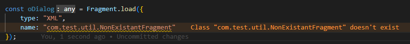
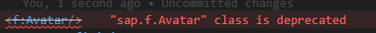
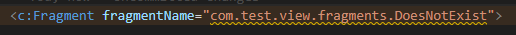

# UI5 Class Linter

Command Line Linter for UI5 based projects.

Any support is highly appreciated!<br/>
[](https://www.paypal.com/donate/?hosted_button_id=HPZ5FA8C3KJ6W)
[](https://github.com/sponsors/iljapostnovs)
[](https://donate.cafe/iljapostnovs)

# Summary

-   [How to use](#how-to-use)
-   [Linters](#linters)
    -   [JS/TS Linters](#jsts-linters)
        -   [AbstractClassLinter](#abstractclasslinter)
        -   [InterfaceLinter](#interfacelinter)
        -   [PublicMemberLinter](#publicmemberlinter)
        -   [UnusedMemberLinter](#unusedmemberlinter)
        -   [WrongClassNameLinter](#wrongclassnamelinter)
        -   [WrongFieldMethodLinter](#wrongfieldmethodlinter)
        -   [WrongImportLinter](#wrongimportlinter)
        -   [WrongOverrideLinter](#wrongoverridelinter)
        -   [WrongParametersLinter](#wrongparameterslinter)
        -   [UnusedClassLinter](#unusedclasslinter)
        -   [WrongNamespaceLinter (TS only)](#wrongnamespacelinter-ts-only)
        -   [EventTypeLinter (TS only, 1.115.1+)](#eventtypelinter-ts-only-11151)
    -   [XML Linters](#xml-linters)
        -   [TagAttributeLinter](#tagattributelinter)
        -   [TagAttributeDefaultValueLinter](#tagattributedefaultvaluelinter)
        -   [TagLinter](#taglinter)
        -   [UnusedNamespaceLinter](#unusednamespacelinter)
        -   [WrongFilePathLinter](#wrongfilepathlinter-1)
    -   [Properties linters](#properties-linters)
        -   [UnusedTranslationsLinter](#unusedtranslationslinter)
        -   [DuplicateTranslationLinter](#duplicatetranslationlinter)
-   [Configuration](#config)
-   [Configuration example](#configuration-example)
-   [Default configuration](#default-linter-config)
-   [Linter exceptions](#linter-exceptions)
    -   [Member errors in TS/JS](#member-errors)
    -   [View and fragment errors](#view-and-fragment-errors)
    -   [i18n errors](#i18n-errors)
    -   [Other ways](#other-ways)
-   [ID and Event Handler patterns in views and fragments](#id-and-event-handler-patterns-in-views-and-fragments)
-   [XML Formatter](#xml-formatter)

---

# How to use

Execute in command line:

```bash
npm install ui5plugin-linter -g
```

After installing the package globally the linter will be available:

```bash
ui5linter
```

Linter also can be used from local `node_modules`:

```bash
npm install ui5plugin-linter --save-dev
npx ui5linter
```

---

# TS vs JS

## Initialization

If `tsconfig.json` is found in the CWD and any `.ts` files are found in the workspace, parser considers that it's TS project. <br/>
`tsconfig.json` should be located in CWD.

## Folder exclusions

For convenience purposes `UI5TSParser` ignores`src-gen` folders, because they contain transpiled JS/XML files, which can make the parser to think that source files are there.

> **Important!** If build folder name is different, it should be added to `excludeFolderPatterns` in your `package.json`.

---

# Linters

## JS/TS Linters

### AbstractClassLinter

Linter, which checks if all members of parent class (which is abstract) are implemented.


### InterfaceLinter

Checks if interface members of an interface are implemented.


### PublicMemberLinter

Checks if currently public member should be private. If no references for the member are found outside the current class, error will be shown.


### UnusedMemberLinter

Checks if member is used anywhere.


### WrongClassNameLinter

Checks if class name is correct.


### WrongFieldMethodLinter

Checks for several things:

-   If member is deprecated


-   If member exists


-   If access level modifiers are used correctly. E.g. if private/protected member from another class is called, it's an error.


### WrongFilePathLinter

Checks if all paths which starts with app id exists



### WrongImportLinter

Checks if imported module exists and is not deprecated


### WrongOverrideLinter

Checks if overriden member is not private


### WrongParametersLinter

Checks for several things:

-   If all parameters are passed to the method
-   If types of the parameters are correct


> **Hint!** To set the type for the variable, JSDocs can be used.

```javascript
/**@type {sap.m.Table}*/
let oTable;
```

> **Hint!** To make parameter optional, JSDocs can be used.

```javascript
/**
 * @param {string} mandatoryParam mandatory parameter
 * @param {string} [optionalParam] optional parameter
 */
myMethod(mandatoryParam, optionalParam) {}
```

### UnusedClassLinter

Checks if class is used


### WrongNamespaceLinter (TS only)

Checks if namespace is provided and if it is correct.


### EventTypeLinter (TS only, 1.115.1+)

Checks if correct type for event variable is used in event handlers


---

## XML Linters

### TagAttributeLinter

Checks if attribute

-   Exists
-   Is not duplicated
-   Value is correct
-   Event handler exists
-   Event handler and id naming style (check [ID and Event Handler patterns in views and fragments](#id-and-event-handler-patterns-in-views-and-fragments))


### TagAttributeDefaultValueLinter

Checks if entered value is not the same as default value


### TagLinter

Checks if:

-   Prefix is defined


-   Aggregation exists


-   Library of aggregation is the same as library of the class


-   Class is not deprecated



-   Class exists


### UnusedNamespaceLinter

Checks if namespace is used


### WrongFilePathLinter

Checks if class exists




## Properties linters

### UnusedTranslationsLinter

Checks if translation is used


### DuplicateTranslationLinter

Checks if translation is not duplicated


---

# Config

## Linter config

UI5 Linter searches for `package.json` (or any other `rc` file, e.g. `.ui5pluginrc`) in your CWD (Current Working Directory) and locates the config there.

Supported `rc` file types:

-   `.ui5pluginrc`
-   `.ui5pluginrc.json`
-   `.ui5pluginrc.yaml`
-   `.ui5pluginrc.yml`
-   `.ui5pluginrc.js`

See [configuration example](#configuration-example) below.

> **Cache** <br/>
> ui5plugin-parser preloads the library metadata and stores it in cache. If `libsToLoad` were changed, it is necessary to clear cache. It is possible by adding `--rmcache` flag to ui5linter: <br/>
>
> ```cmd
> ui5linter --rmcache
> ```

---

## Configuration example

```jsonc
{
	"ui5": {
		"ui5parser": {
			"ui5version": "1.84.30",
			"dataSource": "https://sapui5.hana.ondemand.com/",
			"rejectUnauthorized": true,
			"libsToLoad": ["sap.uxap", "sap.viz"],
			//Handy to add additional workspace paths if e.g. library is outside of CWD
			"additionalWorkspaces": ["../MyLibrary"]
		},
		"ui5linter": {
			"severity": {
				"WrongParametersLinter": "Error",
				"WrongOverrideLinter": "Warning",
				"WrongImportLinter": "Information",
				"WrongFilePathLinter": "Hint"
			},
			"usage": {
				"WrongParametersLinter": true,
				"WrongOverrideLinter": false
			},
			"jsLinterExceptions": [
				{
					"className": "com.test.MyCustomClass",
					/*method or field name*/
					"memberName": "myCustomMethod",
					/*all classes which extends com.test.MyCustomClass will
        inherit this exception as well*/
					"applyToChildren": true
				}
			],
			/*classes to exclude from linting*/
			"jsClassExceptions": ["com.test.MyCustomClass1", "com.test.MyCustomClass2"],
			/*views and fragments to exclude from linting*/
			"xmlClassExceptions": ["com.test.view.Master", "com.test.fragment.MyToolbar"],
			/*array of i18n translation ids to be ignored by UnusedTranslationsLinter*/
			"propertiesLinterExceptions": ["MyView.MyButtonText", "MY_TRANSLATION_ID"],
			"componentsToInclude": ["com.test"],
			/*it makes sense to use only componentsToInclude or componentsToExclude, but not both at once.
      "componentsToExclude" comes in handy when you want to exclude e.g. libraries.
      "componentsToInclude" comes handy when you have many different components which project depends
      on, but it is necessary to lint only one*/
			"componentsToExclude": ["com.custom.library"]
		}
	}
}
```

---

## Default linter config

Default config is as follows:

```jsonc
{
	"ui5": {
		"ui5linter": {
			"severity": {
				"WrongParametersLinter": "Error",
				"WrongOverrideLinter": "Error",
				"WrongImportLinter": "Warning",
				"WrongFilePathLinter": "Warning",
				"WrongFieldMethodLinter": "Warning",
				"WrongClassNameLinter": "Warning",
				"UnusedTranslationsLinter": "Information",
				"UnusedNamespaceLinter": "Error",
				"UnusedMemberLinter": "Information",
				"TagLinter": "Error",
				"TagAttributeLinter": "Error",
				"TagAttributeDefaultValueLinter": "Information",
				"PublicMemberLinter": "Information",
				"InterfaceLinter": "Error",
				"AbstractClassLinter": "Error",
				"UnusedClassLinter": "Error",
				"WrongNamespaceLinter": "Warning",
				"DuplicateTranslationLinter": "Error",
				"EventTypeLinter": "Error"
			},
			"usage": {
				"WrongParametersLinter": true,
				"WrongOverrideLinter": true,
				"WrongImportLinter": true,
				"WrongFilePathLinter": true,
				"WrongFieldMethodLinter": true,
				"WrongClassNameLinter": true,
				"UnusedTranslationsLinter": true,
				"UnusedNamespaceLinter": true,
				"UnusedMemberLinter": true,
				"TagLinter": true,
				"TagAttributeLinter": true,
				"TagAttributeDefaultValueLinter": true,
				"PublicMemberLinter": true,
				"InterfaceLinter": true,
				"AbstractClassLinter": true,
				"UnusedClassLinter": true,
				"WrongNamespaceLinter": true,
				"DuplicateTranslationLinter": true,
				"EventTypeLinter": true //true if UI5 version is >=1.115.1
			},
			"jsLinterExceptions": [
				{
					"className": "sap.ui.core.Element",
					"memberName": "getDomRef",
					"applyToChildren": true
				},
				{
					"className": "sap.ui.model.json.JSONModel",
					"memberName": "iSizeLimit",
					"applyToChildren": true
				},
				{
					"className": "sap.ui.model.Binding",
					"memberName": "*"
				},
				{
					"className": "sap.ui.model.Model",
					"memberName": "*"
				},
				{
					"className": "sap.ui.core.Element",
					"memberName": "*"
				},
				{
					"className": "sap.ui.base.ManagedObject",
					"memberName": "*"
				},
				{
					"className": "sap.ui.core.Control",
					"memberName": "*"
				},
				{
					"className": "sap.ui.xmlfragment",
					"memberName": "*"
				},
				{
					"className": "*",
					"memberName": "byId"
				},
				{
					"className": "*",
					"memberName": "prototype"
				},
				{
					"className": "*",
					"memberName": "call"
				},
				{
					"className": "*",
					"memberName": "apply"
				},
				{
					"className": "*",
					"memberName": "bind"
				},
				{
					"className": "*",
					"memberName": "constructor"
				},
				{
					"className": "*",
					"memberName": "init"
				},
				{
					"className": "*",
					"memberName": "exit"
				},
				{
					"className": "map",
					"memberName": "*"
				}
			],
			"jsClassExceptions": [],
			"xmlClassExceptions": [],
			"propertiesLinterExceptions": [],
			"componentsToInclude": [],
			"componentsToExclude": [],
			"idNamingPattern": "^id{MeaningAssumption}.*{ControlName}$",
			"eventNamingPattern": "^on{MeaningAssumption}{ControlName}.*?{EventName}$",
			"attributesToCheck": ["content", "items", "value", "text", "number"]
		}
	}
}
```

It is possible to override properties in your `package.json`. See [Configuration example](#configuration-example)

> In case of `jsLinterExceptions` the exceptions which will be found in `package.json` of CWD will be added to the default exceptions, in the rest of the cases properties will be overwritten

---

## Parser config

It is possible to add config for [ui5plugin-parser](https://www.npmjs.com/package/ui5plugin-parser) as well.

> Check [ui5plugin-parser](https://www.npmjs.com/package/ui5plugin-parser) -> `Config default values` as a reference for parser properties</br>
> See [Configuration example](#configuration-example)

---

## Linter exceptions

There are multiple ways to configure linter exceptions.

### JS/TS

#### Member errors

To ignore class member errors, there are two ways to do it.
Lets assume that there is a line, which gives incorrect amount of arguments error

```javascript
this._myMethod("123", 643, true); //Method "_myMethod" has 2 (2 mandatory) param(s), but you provided 3
```

In order to ignore this error, there are two ways to do it:

1. Add `@ui5ignore` to method declaration JSDoc

```javascript
/**
 * @ui5ignore
 */
_myMethod(sFirstParam, iSecondParam) {}
```

2. Add method to `jsLinterExceptions` in `package.json`:

```json
{
	"ui5": {
		"ui5linter": {
			"jsLinterExceptions": [
				{
					"className": "com.test.MyClass",
					"memberName": "_myMethod",
					"applyToChildren": true
				}
			]
		}
	}
}
```

### View and fragment errors

To ignore attribute and tag errors, `<-- @ui5ignore -->` can be used. It will ignore all errors of next tag and its attributes.

```XML
<!-- @ui5ignore -->
<RandomText
	randomProperty="123"
/>
```

To ignore specific attribute, `<-- @ui5ignore ${attributeName1}, ${attributeName2} -->` can be used. It will ignore all attribute errors

```XML
<!-- @ui5ignore randomProperty, secondRandomProperty -->
<Text
	randomProperty="123"
	secondRandomProperty="123"
	text="Valid property"
/>
```

To ignore all id and event handler pattern errors of the next tag, `<-- @ui5ignore-patterns -->` can be used.

```XML
<!-- @ui5ignore-patterns -->
<Text
	id="myRandomId"
/>
```

To ignore specific id or event handler pattern errors of the next tag, `<-- @ui5ignore-patterns ${attributeName1}, ${attributeName2} -->` can be used.

```XML
<!-- @ui5ignore-patterns id -->
<Button
	id="myRandomId"
	press="myRandomHandler"
/>
```

### i18n errors

To ignore translation errors, `# @ui5ignore` comment right above the translation can be used

```properties
# @ui5ignore
MY_TITLE = Title
```

### Other ways

#### Exclude whole class

To exclude whole class from linting, add class name to `package.json`. In case of JS Classes, use `jsClassExceptions`. In case of view and fragments, use `xmlClassExceptions`

```json
{
	"ui5": {
		"ui5linter": {
			"jsClassExceptions": ["com.test.MyClass"]
		}
	}
}
```

#### Exclude i18n translations

To exclude translation from linting in `18n.properties` file, add class name to `package.json`

```json
{
	"ui5": {
		"ui5linter": {
			"propertiesLinterExceptions": ["MY_TRANSLATION_ID"]
		}
	}
}
```

#### Exclude other apps or libs

Lets assume that there is a library included in the project, and there is no need to lint it.
To exclude whole app or lib from linting, add app/lib id to `package.json`. There are two preference entries that can be used: `componentsToInclude` and `componentsToExclude`.

```json
{
	"ui5": {
		"ui5linter": {
			"componentsToInclude": ["com.test.my.app"],
			"componentsToExclude": ["com.test.my.lib"]
		}
	}
}
```

---

## ID and Event Handler patterns in views and fragments

In order to keep the same style for naming the `id` and any `event handler` in views and fragments, three configuration entries are available: `idNamingPattern`, `eventNamingPattern`, `attributesToCheck`. Every `id` and `event handler` generates individual `RegExp`, and the value is checked against it.

> **Hint!** To disable naming style checking, just set `idNamingPattern` or/and `eventNamingPattern` as empty string in `package.json`

### Variables

In order to generate individual `RegExp`, there are variables available which will be applied at runtime. All variables are available in `camelCase` and `PascalCase`.

Example of `eventNamingPattern`: `^on{MeaningAssumption}{ControlName}.*?{EventName}$`.
Variables: `MeaningAssumption`, `ControlName`, `EventName`.

```xml
<Input
	value="{ODataModel>Currency}"
	change=""
>
<!-- Pattern for 'change': ^onCurrencyInput.*?Change$ -->
```

#### ControlName variable

Variable is replaced with the name of the tag. Available for both `id` and `event handler` patterns.

```xml
<Text/>
<!-- ControlName => Text -->
<!-- controlName => text -->
<f:GridList/>
<!-- ControlName => GridList -->
<!-- controlName => gridList -->
```

#### EventName variable

Variable is replaced with the name of the event. Available for `event handler` patterns only.

```xml
<Button press="onButtonPress"/>
<!-- EventName => Press -->
<!-- eventName => press -->
<f:GridList borderReached="onGridListBorderReached"/>
<!-- EventName => BorderReached -->
<!-- eventName => borderReached -->
```

#### MeaningAssumption variable

Variable is replaced with guessed value taken from attribute. Available for both `id` and `event handler` patterns. This is the most tricky variable.

It is calculated as follows:

1. Get value of `attributesToCheck` configuration
2. Find first attribute from the control which exists in `attributesToCheck` array.
3. Parse attribute value
    1. If attribute value is a binding, use binding text as a source for `MeaningAssumption`
        1. Find binding path. If binding path is an object, parse it and take the text from `path` field, otherwise crop `{` and `}`
        2. Split string by `>`, left part is model name, right part is `binding path`
            1. If model name is `i18n`, find the translation in `i18n.properties`, transform value to PascalCase and return the value
            2. Else, remove `/results` from `binding path`, split the result by `_`, transform to PascalCase and return the value
    2. If attribute value is not a binding, transform the value to PascalCase and return it

| Attribute value           | MeaningAssumption value                                |
| ------------------------- | ------------------------------------------------------ |
| {/OrderItems}             | OrderItems                                             |
| {OrderId}                 | OrderId                                                |
| {/OrderItems/results}     | OrderItems                                             |
| {ODataModel>/ORDER_ITEMS} | OrderItems                                             |
| {MyModel>/Orders}         | Orders                                                 |
| {i18n>APP_TITLE}          | OrderApp (if text in `i18n.properties` is "Order App") |

> **Hint!** > `MeaningAssumption` is pure heuristics and of course will not work for all the cases. If it works most of the time well, but there are some exceptions, it is possible to ignore specific tag attribute errors. Check [View and fragment errors](#view-and-fragment-errors) section.

Example.

```xml
<List
	id="idOrderItemsList"
	items="{ODataModel>/OrderItems}"
	press="onOrderItemsListPress"
/>
<!--
	ControlName => List
	controlName => list
	EventName => Press
	eventName => press
	MeaningAssumption => OrderItems
	meaningAssumption => orderItems
 -->
```

### attributesToCheck configuration

This configuration is a list of attributes, where `MeaningAssumption` will be guessed from.
For instance, if `attributesToCheck` is set to `"attributesToCheck": ["items"]`, the value will be guessed only from `items` attribute, e.g. in `sap.m.List`:

```xml
<List
	id="idOrdersList"
	items="{/Orders}"
/>
```

---

## XML Formatter

It is possible to format fragments and views using CMD.

```bash
ui5linter --format
```

### Path pattern

It is possible to set the path pattern of the files which should be formatted.
Default value: ­`**/*.{fragment,view}.xml`

```bash
ui5linter --format --path=**/*.{fragment,view}.xml
```

### Closing tag on newline

It is possible to pass a parameter if closing tags (">", "/>") should be located on newline

```bash
ui5linter --format --tagEndNewline
```

### Add space before a self-closing tag

It is possible to pass a parameter if a space should be added before a self-closing tag ("/>")

```bash
ui5linter --format --tagSpaceBeforeSelfClose
```

---

## package.json interface

The technical interface of possible entries:

```ts
interface IUI5PackageConfigEntry {
	ui5?: IUI5LinterEntry;
}
interface IUI5LinterEntry {
	ui5linter?: IUI5LinterEntryFields;
}
interface IUI5LinterEntryFields {
	severity?: {
		[key in JSLinters | XMLLinters | PropertiesLinters]: Severity;
	};
	usage?: {
		[key in JSLinters | XMLLinters | PropertiesLinters]: boolean;
	};
	jsLinterExceptions?: JSLinterException[];
	jsClassExceptions?: string[];
	xmlClassExceptions?: string[];
	propertiesLinterExceptions?: string[];
	componentsToInclude?: string[];
	componentsToExclude?: string[];
	idNamingPattern?: string;
	eventNamingPattern?: string;
	attributesToCheck?: string[];
}
```

Enumerations:

```ts
enum PropertiesLinters {
	UnusedTranslationsLinter = "UnusedTranslationsLinter",
	DuplicateTranslationLinter = "DuplicateTranslationLinter"
}
enum XMLLinters {
	TagAttributeLinter = "TagAttributeLinter",
	TagAttributeDefaultValueLinter = "TagAttributeDefaultValueLinter",
	TagLinter = "TagLinter",
	UnusedNamespaceLinter = "UnusedNamespaceLinter",
	WrongFilePathLinter = "WrongFilePathLinter"
}
enum JSLinters {
	AbstractClassLinter = "AbstractClassLinter",
	InterfaceLinter = "InterfaceLinter",
	PublicMemberLinter = "PublicMemberLinter",
	UnusedMemberLinter = "UnusedMemberLinter",
	WrongClassNameLinter = "WrongClassNameLinter",
	WrongFieldMethodLinter = "WrongFieldMethodLinter",
	WrongFilePathLinter = "WrongFilePathLinter",
	WrongImportLinter = "WrongImportLinter",
	WrongOverrideLinter = "WrongOverrideLinter",
	WrongParametersLinter = "WrongParametersLinter",
	UnusedClassLinter = "UnusedClassLinter",
	WrongNamespaceLinter = "WrongNamespaceLinter",
	EventTypeLinter = "EventTypeLinter"
}
enum Severity {
	Warning = "Warning",
	Error = "Error",
	Information = "Information",
	Hint = "Hint"
}
```
